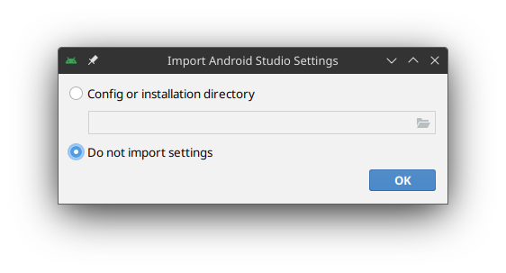

# Andoid Studio

## Linux

1. Visite o site do [Android Studio](https://developer.android.com/studio?hl=pt-br).
2. Efetue um clique no botão «Fazer o *download* do Android Studio Hedgehog». Ao efetuá-lo, receberá uma janela pop-up em que deverá marca a opção «Eu li e concordo com os termos e condições acima» e clicar no botão «Fazer o *download* do Android Studio para Linux».
3. Salve o arquivo compresso diretamente na pasta «Downloads» ou «Transferências».
4. Crie quatro pastas:

   ```sh
   mkdir -p ~/.android/Sdk
   mkdir -p ~/.local/share/applications
   mkdir -p ~/.local/share/icons
   mkdir -p "$HOME/Aplicativos/Binários/Android Studio"
   ```

5. Crie uma pasta temporária e extraia o conteúdo do arquivo compresso nela, e mova a pasta resultante para a pasta «Aplicativos»:

   ```sh
   cd ~/Downloads
   mkdir android-studio
   tar -xvzf android-studio-*.tar.gz -C android-studio --strip-components=1
   ```

6. Mova todos os arquivos da pasta «android-studio» para a pasta «Android Studio» da pasta «Aplicativos»:

   ```sh
    mv android-studio/* "$HOME/Aplicativos/Binários/Android Studio"
    cd ~
    ```

7. Crie um atalho para o Android Studio:
   
   ```sh
   echo -e "[Desktop Entry]\nCategories = Development; IDE;\nComment = The Android development environment based on IntelliJ IDEA to write Android apps\nComment[pt_BR] = Ambiente de desenvolvimento baseado na versão comunitária de IntelliJ IDEA para escrever os aplicativos de Android\nComment[pt_PT] = Ambiente de desenvolvimento baseado na versão comunitária de IntelliJ IDEA para escrever as aplicações de Android\nEncoding = UTF-8\nExec = \"\$HOME/Aplicativos/Binários/Android Studio/bin/studio.sh\" %f\nGenericName = IDE\nIcon = android-studio\nName = Android Studio\nStartupWMClass = jetbrains-studio\nTerminal = false\nType = Application\nVersion = 1.0" > ~/.local/share/applications/android-studio.desktop
   ```

8. Crie as exportações das variáveis de ambiente:

   ```sh
   # Bash
   echo -e "\n# Android Studio\nexport ANDROID_HOME=\"\$HOME/.android/Sdk\"\nexport PATH=\"\$PATH:\$ANDROID_HOME/tools\"\nexport PATH=\"\$PATH:\$ANDROID_HOME/platform-tools\"" >> ~/.bashrc
   # ZSH
   echo -e "\n# Android Studio\nexport ANDROID_HOME=\"\$HOME/.android/Sdk\"\nexport PATH=\"\$PATH:\$ANDROID_HOME/tools\"\nexport PATH=\"\$PATH:\$ANDROID_HOME/platform-tools\"" >> ~/.zshrc
   ```

9. Abra o Android Studio. 
10. Receberá uma janela *pop-up* em que deverá marcar a opção «Do not import settings» (em português, «Não importar configurações») e clicar no botão «OK».

    

11. Receberá uma outra janela *pop-up* em que deverá efetuar um clique no botão «Do not send» (em português, «Não enviar»).

    

12. Receberá uma janela de bem-vindo ao Android Studio. Clique no botão «Next» (em português, «Seguinte»).

    

13. Em seguida, deverá escolher a opção «Custom» (em português, «Personalizado») e clicar no botão «Next» (em português, «Seguinte»).

    

14. Deverá efetuar um clique no ícone de pasta na caixa de caminho para mudar a pasta de instalação para o caminho `~/.android/Sdk`. Ao realizar um clique, receberá uma janela *pop-up* de seleção de pasta. Nela, deverá clicar no ícone de olho para mostrar as pastas ocultas e selecionar a pasta `~/.android/Sdk`. Em seguida, deverá clicar no botão «OK».

    
    

15. Continue em efetuar clique no botão «Next» (em português, «Seguinte») até chegar à janela de acordo de licenças de componentes de SDK em que selecionará cada componente para marcar e selecionar a opção «Accept» (em português, «Aceitar»). Então clique no botão «Next» (em português, «Seguinte»).

    

16. Continue em efetuar clique no botão «Finish». Em seguida, terá de esperar o Android Studio transferir e instalar os componentes de SDK. Ao terminar, deverá clicar no botão «Finish».
